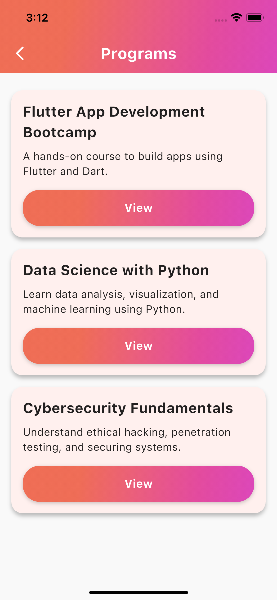
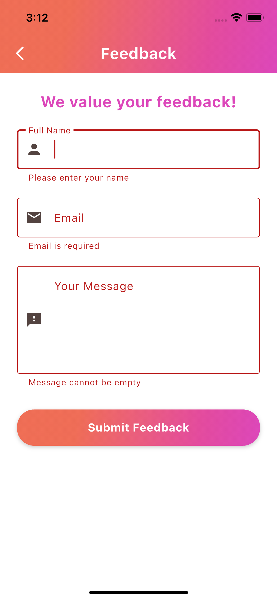

# 🚀 Excelerate App

A cross-platform mobile application built using **Flutter** and **Dart**, developed as part of the *Excelerate Internship Program*.  
The app focuses on creating a clean, branded, and interactive experience — following the provided wireframes and color theme.

---

## 🧩 Features Implemented

✅ **Landing Page / Launch Screen** – Initial welcome screen shown when the app starts.  
✅ **Login Screen** – Allows users to sign in with email and password.  
✅ **Signup Screen** – Enables new users to register and agree to terms.  
✅ **Home Screen** – Base navigation screen leading to the program listing.  
✅ **Program Listing Screen** – Now fetches data dynamically from a **mock API/JSON** instead of hardcoded text.  
✅ **Program Details Screen** – Shows detailed information for a selected program with enrollment functionality.  
✅ **Feedback Form** – Added a working feedback form with **validation** (name, email, message) and mock submission.  
✅ **Registration Form** – Validated email and password fields added for registration.

---

## 🧭 Navigation Flow

1. **Launch Screen → Login Screen**  
2. **Login → Home Screen**  
3. **Home → Program Listing Screen** (API connected)  
4. **Program Listing → Program Details Screen**  
5. **Program Details → Feedback Form** (validated form submission)

All screens are fully functional, connected using Flutter’s `Navigator`, and fetch real/mock data where required.

---

## 🎨 Design & Branding

The app follows the **Excelerate theme**:
- Background color: Light neutral tone  
- Primary buttons: Gradient buttons consistent across the app  
- Font: Clean, readable sans-serif  
- Consistent padding, rounded corners, and alignment throughout the UI  

---

## 📱 Screenshots

### 🏁 Landing Page
  
*Welcome screen displayed when the app starts.*

### 🔐 Login Screen


### 📝 Signup Screen


### 🏠 Home Screen


### 📋 Program Listing Screen (API Connected)
  
*Displays live data fetched from a mock API.*

### 📄 Program Details Screen
  
*Shows dynamic program details and enrollment confirmation.*

### 📝 Feedback Form
  
*Validated form with mock submission and success feedback.*

---

## 🧰 Tech Stack

- **Framework:** Flutter  
- **Language:** Dart  
- **Platform:** Android & iOS  
- **IDE:** Visual Studio Code  
- **Version Control:** Git & GitHub

---

## 💻 How to Run the App

1. Clone this repository:
   ```bash
   git clone https://github.com/kingdivyesh/excelerate_app.git
   cd excelerate_app

2. Get dependencies :
   flutter pub get

3. Run the app :
   flutter run

## 📝 Week 3 Updates

- **Program Listing & Details screens** now fetch data dynamically from a mock API/JSON.  
- **Feedback Form** added with validation (name, email, message) and mock submission.  
- **Registration Form** added with email and password validation.  
- **Loading & Error Handling**:  
  - CircularProgressIndicator shown while fetching API data.  
  - Friendly error messages displayed if API fails.  
  - Feedback form disables submit button while submitting and shows success/failure messages.  
- **Enrollment Flow**: “Enroll Now” button shows success dialog and navigates to feedback form.

