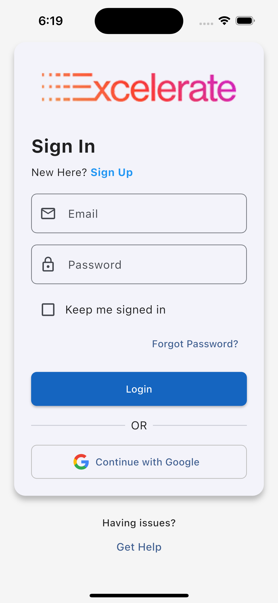
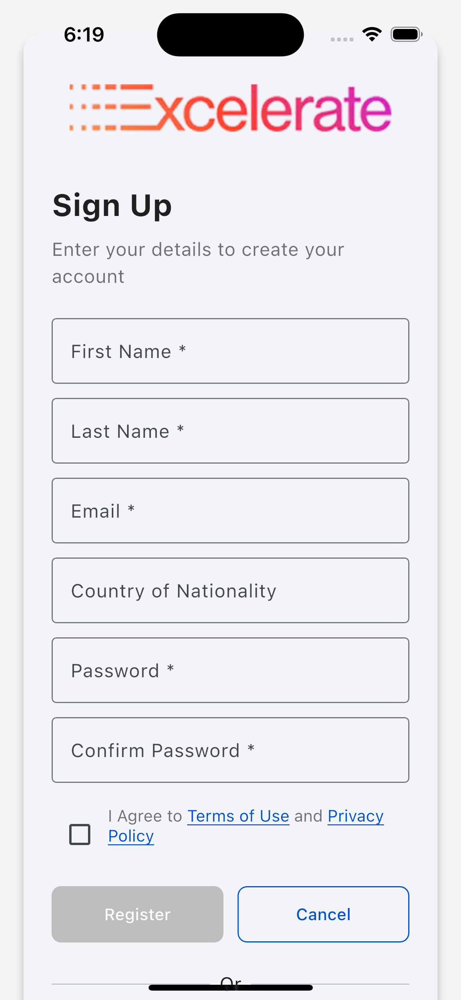
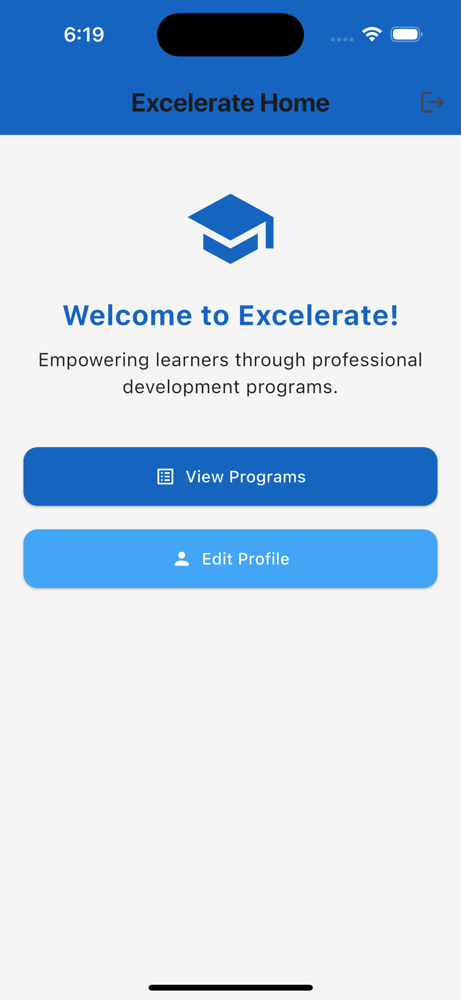
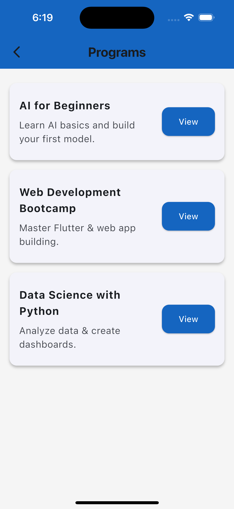

# 🚀 Excellerate App

A cross-platform mobile application built using **Flutter** and **Dart**, developed as part of the *Excelerate Internship Program*.  
The app focuses on creating a clean, branded, and interactive experience — following the provided wireframes and color theme.

---

## 🧩 Features Implemented

✅ **Login Screen** – Allows users to sign in with email and password.  
✅ **Signup Screen** – Enables new users to register and agree to terms.  
✅ **Home Screen** – Base navigation screen leading to the program listing.  
✅ **Program Listing Screen** – Displays a list of available programs.  
✅ **Program Details Screen** – Shows detailed information for a selected program.  

---

## 🧭 Navigation Flow

1. **Launch Screen → Login Screen**  
2. **Login → Home Screen**  
3. **Home → Program Listing Screen**  
4. **Program Listing → Program Details Screen**

All screens are fully functional and connected using Flutter’s `Navigator`.

---

## 🎨 Design & Branding

The app follows the **Excelerate theme**:
- Background color: Light neutral tone  
- Primary buttons: Deep blue with contrasting white text  
- Font: Clean, readable sans-serif  
- Consistent padding, rounded corners, and alignment throughout the UI  

---

## 📱 Screenshots

Below are screenshots of the working UI prototype:

### 🔐 Login Screen


### 📝 Signup Screen


### 🏠 Home Screen


### 📋 Program Listing Screen


### 📄 Program Details Screen


---

## 🧰 Tech Stack

- **Framework:** Flutter  
- **Language:** Dart  
- **Platform:** Android & iOS  
- **IDE:** Visual Studio Code  
- **Version Control:** Git & GitHub

---

## 💻 How to Run the App

1. Clone this repository:
   ```bash
   git clone https://github.com/kingdivyesh/excelerate_app.git
   cd excelerate_app
